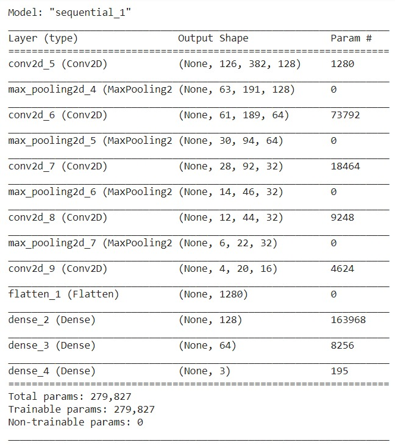
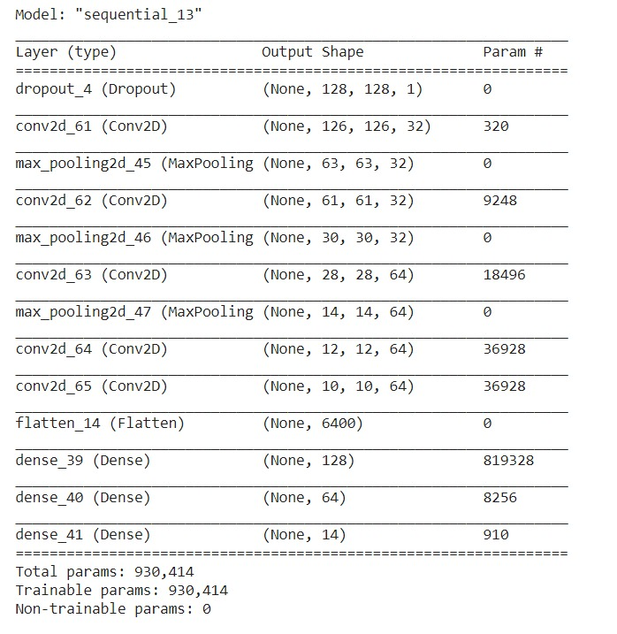

# Hack the Summer
Project by Sarthak

Used - Python, Tensorflow, Keras, Google Colab, skimage, NumPy

## Task - 1

In this task, we had to predict the expression style (Label): infix, prefix or postfix). First of all, we divided the given dataset into three folders named `infix`, `prefix` and `postfix`. And then we further divided them into training and validation sets. Validation set was 10% of the total data.

Then used `ImageDataGenerator` from `tensorflow.keras.preprocessing.image` to load datasets. we used a CNN model.
#### Model Summary

After 10 epochs, our training accuracy was 100% and validation accuracy was 99.9%.
I stopped training there and saved the model.

## Task - 2

For this task, we divided the images into three parts of size (128 x 128). After dividing the images,
I found that many pictures were repeated, then we deleted all duplicate images using a python code. we was left with only 10% of all images. To label the images,
I used an external handwritten math symbol [dataset](https://www.kaggle.com/clarencezhao/handwritten-math-symbol-dataset).
First we trained one model using that external dataset and then used that to label our images. But this model was giving too many wrong predictions.  
By using some automation codes in Python, and by calculating expressions according to the predictions given by this model, we labelled almost all the images correctly.
Then on this dataset, we trained a CNN model. 
#### Model Summary

After 20 epochs, our training accuracy was ~99% and validation accuracy was >99% and we noticed that accuracy wasn't improving much from last 5 epochs. 
So, we stopped training there and saved the model.

While calculating the expression, the image is first divided into three parts and then we predict three symbols and then calculate the expression.
